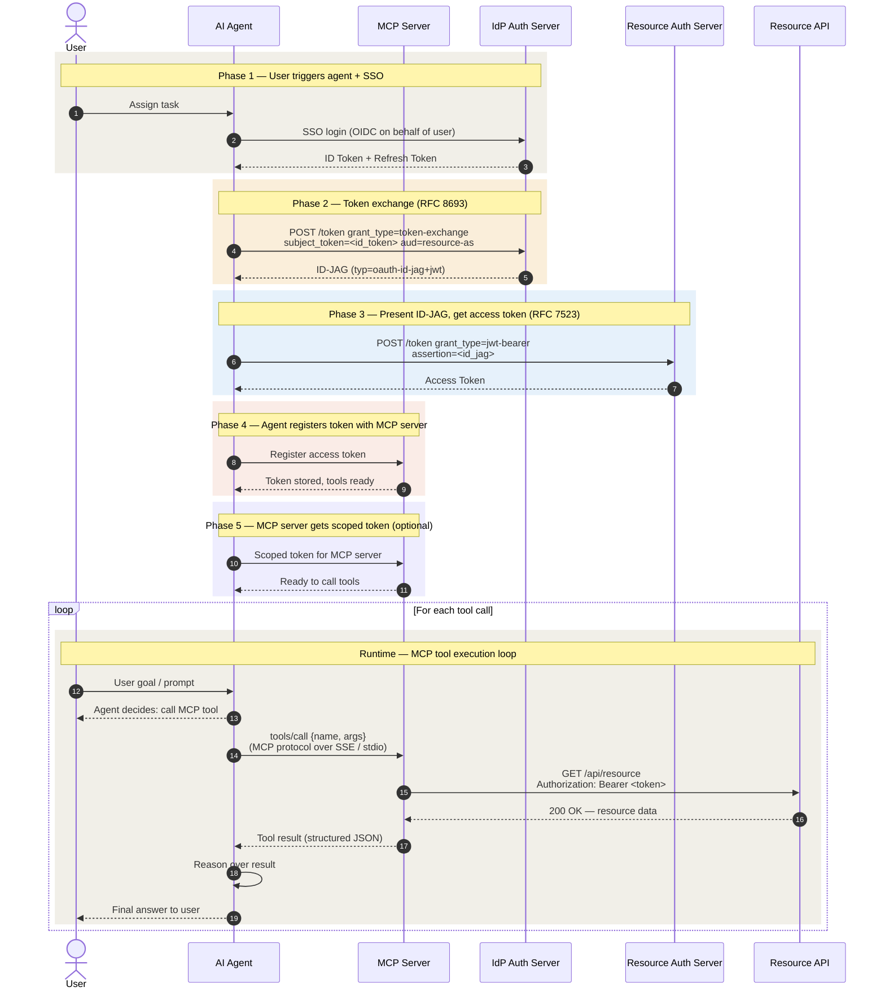

# AIAgent Clients Module

Specialized module for creating standardized M2M clients for AI Agents with enforced naming and hardcoded security settings.

## 📋 Overview

✅ **Enforced Naming**: `aiagent_<ServiceType>_<AppName>`
✅ **Service Type Validation**: Only allowed types (currently: MCP)
✅ **Structured Description**: `<AppOwner>;<TeamName>;<TeamEmailID>`
✅ **Hardcoded Settings**: Consistent security configuration
✅ **Client Credentials Only**: Service-to-service authentication
✅ **Single Scope**: Each agent gets exactly one default scope  

## 🚀 Quick Start

1. Deploy scopes: `cd ../scopes && terraform apply`
2. Edit `apps.yaml` with your AI agent configuration
3. Deploy: `terraform apply`
4. Get credentials: `terraform output aiagent_summary`

## ⚙️ Configuration (apps.yaml)

```yaml
realm: AIAgent

clients:
  - app_name: oktaAPI
    service_type: MCP  # Required: Only MCP allowed currently
    owner: Kraaj
    team: Identity Platform
    email: identity-platform@company.com
    scope: okta-api-access
```

## Flow Diagram


## 🔒 Hardcoded Settings

- Client ID: `aiagent_<ServiceType>_<AppName>` (enforced)
- Display Name: `AIAgent-<ServiceType>-<AppName>` (enforced)
- Description: `<Owner>;<Team>;<Email>` (enforced)
- Grant Type: Client Credentials only
- Token Lifespan: 30 minutes (1800s)
- Enabled: Always true
- Client Secret: Auto-generated 48 characters
- Scope: Default (not optional)

## 🔍 Outputs

```bash
# Summary
terraform output aiagent_summary

# Full config
terraform output -json aiagent_clients | jq '.["aiagent_MCP_oktaAPI"]'

# Secret
terraform output -json aiagent_client_secrets | jq -r '.["aiagent_MCP_oktaAPI"]'
```

## 🧪 Testing Client Credentials

### Option 1: Automated Setup (Recommended)

Run the helper script to extract credentials and populate test files:

```bash
./update-test-credentials.sh aiagent_MCP_oktaAPI
```

This will:
- Update `.env` with client credentials
- Update `test.http` with the same credentials
- Display a ready-to-use cURL command

### Option 2: REST Client (VS Code)

1. Install the **REST Client** extension in VS Code
2. Open `test.http`
3. Click "Send Request" above the POST request
4. View the access token in the response

### Option 3: Test Script (Recommended for cURL)

```bash
./test-token.sh
```

This script properly handles special characters in the client secret and displays a formatted response.

### Option 4: Manual cURL

```bash
source .env
curl -X POST "$KEYCLOAK_URL/realms/$REALM/protocol/openid-connect/token" \
  -H "Content-Type: application/x-www-form-urlencoded" \
  --data-urlencode "grant_type=client_credentials" \
  --data-urlencode "client_id=$CLIENT_ID" \
  --data-urlencode "client_secret=$CLIENT_SECRET" \
  --data-urlencode "scope=$SCOPE"
```

**Note:** Use `--data-urlencode` instead of `-d` to properly handle special characters in the client secret.

## 📝 Service Type Validation

Client naming convention: `aiagent_<ServiceType>_<AppName>`

- Currently allowed: `MCP`
- To add more types: Edit `allowed_service_types` in `main.tf`
- Invalid types will fail during terraform plan with a clear error

See full documentation in the main app README.


