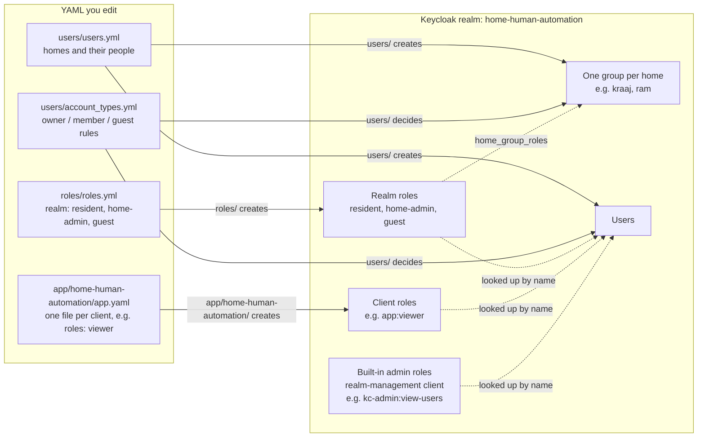
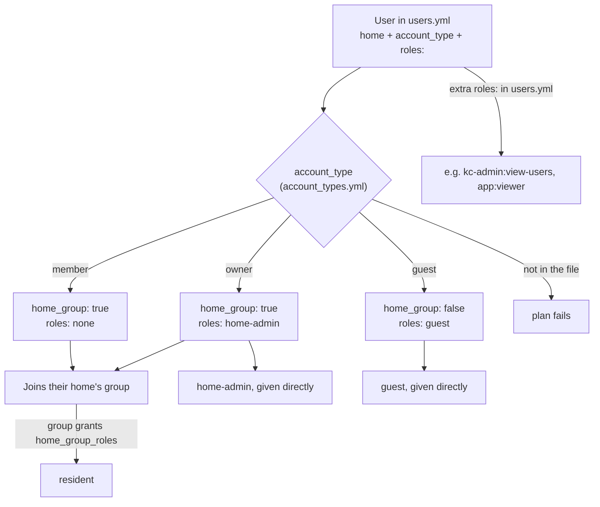

# users/home-human-automation

Realm-wide identity concerns for the home-human-automation realm, kept separate from
`app/home-human-automation/` (which owns application-level clients and app-specific roles
only). This directory owns:

- **The actual residents** — one `users.yml`, grouped under one key per home (`home1:`
  today, add keys like `home2:`, `office:` as you expand), each listing that home's
  people. Owner-reviewed only, never
  self-service — real human identities (PII) always go through the same review path as
  `config/realm/`, regardless of who administers a given home. See CODEOWNERS.
- **`account_type` on each member** — `owner`, `member` or `guest`, defined in
  `users/account_types.yml` (edit that file to change what a type gets or add a new one,
  no Terraform change needed). Today: `owner` also gets the `home-admin` role (this
  home's admin) on top of `resident`; `member` gets nothing extra; `guest` gets the
  `guest` role and is kept out of the home group, so no `resident`. An optional per-member `roles:` list adds further grants beyond that
  (`kc-admin:<role>`, `<client_name>:<role>`) — you don't need to know Keycloak role names
  just to declare who owns a home.
- **One Keycloak Group per home**, named after the home key (e.g. `home1`) — every owner
  and member listed under that home becomes a group member (`keycloak_group_memberships`,
  derived automatically, no separate registry needed). The group is auto-granted the
  `resident` role (`home_group_roles` in `users/account_types.yml`, via `keycloak_group_roles`), so `resident` is never listed on an
  individual member — it always comes from group membership.
- **All roles in one file** — `roles.yml`, grouped under one key per role type —
  `realm:` (created here) or `kc-admin:` (Keycloak built-in, looked up). Both
  kinds are described below.
- **Global (realm) roles** — `realm:` in `roles.yml`: `resident` (group-granted, see
  above), `guest`, and `home-admin`. `home-admin` only ever reaches a member via `account_type:
  owner` — not every member of a home is its owner, so it can't be a group-level grant.
  "Admin of which home" is the combination of the `home-admin` role plus that person's own
  home-group membership; **the consuming application must check both claims
  together** — Keycloak grants the role and records the membership as two separate
  facts, it doesn't fuse them into one "admin-of-home1-specifically" permission on its
  own.
- **Keycloak admin role references** — `kc-admin:` in `roles.yml`,
  what a user can do in Keycloak itself (e.g. `manage-users`), looked up on the realm's
  built-in `realm-management` client, never created. Not the same as the `home-admin` realm
  role above, which is this app's home-admin permission.

A member's optional `roles:` list can reference `kc-admin:<role>` for a Keycloak admin
role, or `<client_name>:<role>` for an app-specific client role — the latter is
**not owned here**. Client roles are defined inline in that client's own file,
`app/home-human-automation/<client_name>.yaml`'s `roles:` key (app-level, since
they're inherently tied to that app's own client), and `users/` looks them up by name in
Keycloak, read-only.

## How users get their roles

### Which file feeds what

Each YAML file on the left is read by one Terraform folder, which creates (or looks up)
the Keycloak objects on the right. Apply top to bottom: a role must exist before a user
can be given it.



### What each account type gets

`users/` reads a user's `account_type`, applies that type's rules from
`account_types.yml`, then adds the user's own `roles:` from `users.yml` on top.



So, for the people in `users.yml` today:

| User | Account type | In home group | Roles |
|---|---|---|---|
| `kraaj`, `sarah.miller` | owner | yes | `resident` (from the group), `home-admin`, `kc-admin:view-users` |
| `john.doe`, `priya.sharma` | member | yes | `resident` (from the group) |
| `mike.johnson`, `arjun.kumar` | guest | no | `guest` |

"Admin of which home" is the `home-admin` role **plus** the user's home group: the app
must check both (see "Known gap" below for getting the group into the token).

## Reading a user's password

Each user gets a random starting password from Terraform unless `random_password: false`
is set on them in `users.yml`. Run this from `users/` after `terraform apply`:

```sh
cd users

# every user, as JSON: { "<home>/<username>": "<password>", ... }
terraform output -json initial_passwords

# one user (needs jq)
terraform output -json initial_passwords | jq -r '."kraaj/kraaj"'
```

In PowerShell, without jq:

```powershell
(terraform output -json initial_passwords | ConvertFrom-Json).'kraaj/kraaj'
```

Things to know:

- **Log in with the username** (e.g. `kraaj`), not the `<home>/<username>` key.
- **First login:** with `temporary_password: true` (the default) Keycloak asks the user to
  set a new password, so the output is only good once. With `false` (e.g. test users)
  it keeps working.
- **Only the starting password.** It's set when the user is created; after that Keycloak
  owns it. If the user (or an admin) changes it, the output is out of date. Changing
  `users.yml` doesn't reset it.
- **Reset a forgotten password** in the Keycloak admin console: Users → the user →
  Credentials → Reset password.
- **Keep it private.** The output is marked sensitive, but the passwords are stored in
  plain text in `users/terraform.tfstate`. Don't commit or share state files.

## Known gap: group membership isn't in the token yet

Keycloak does **not** include group membership in an issued token by default — it needs
an explicit "Group Membership" protocol mapper added to a client scope the requesting
client includes. That mapper isn't configured anywhere in this repo yet (clients are created
in `app/home-human-automation/public/` and `private/`, but none adds this mapper yet). Until it is, a consuming app can't actually read "which home does this admin
belong to" from the token, even though the group and role both exist correctly in
Keycloak. Needs to be added to `modules/client/` or a client scope.

## Apply order

Two separate Terraform roots, each with its own state:

- `roles/` — `roles.yml`; creates the realm roles and looks up the `kc-admin` roles.
- `users/` — `users.yml`; creates users, home groups and role assignments. Finds every
  role it grants by name in Keycloak (`data "keycloak_role"`), so it reads no other
  folder's state file — the same code works for any realm. A role that doesn't exist yet
  fails the plan.

`config/realm/` (creates the realm itself) → `app/home-human-automation/public/` and
`private/` (create clients) → `app/home-human-automation/` (client-specific roles) →
`roles/` → `users/`.
